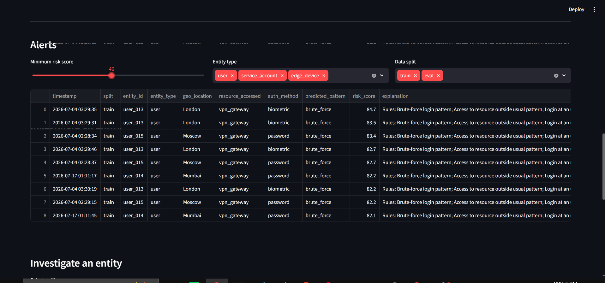
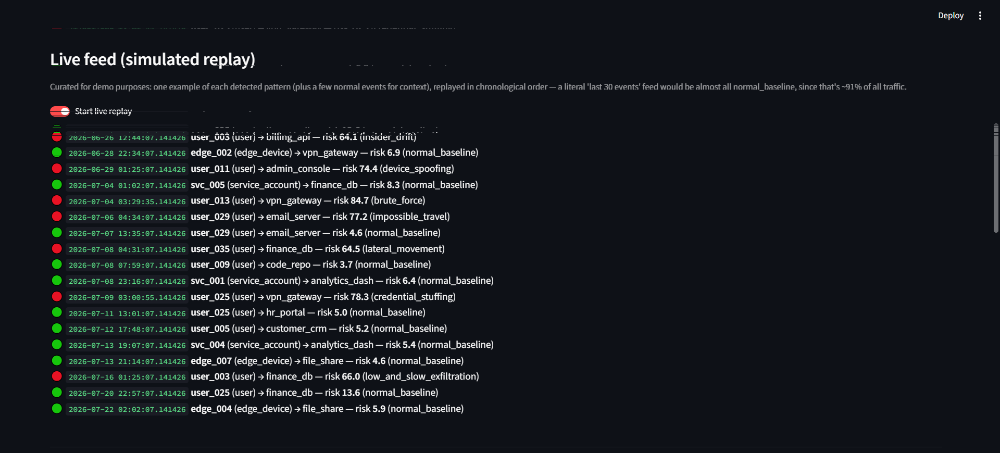
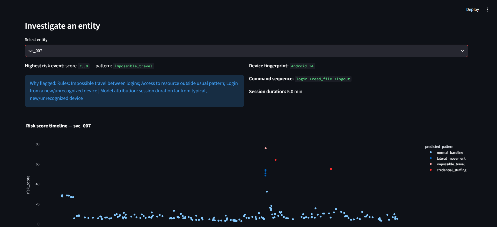

# Behavioral Anomaly Detection System

> **Enterprise-grade ML pipeline** for detecting cyberattack patterns in access logs — using a 4-signal ensemble (deterministic rule engine, Isolation Forest, XGBoost, LSTM autoencoder) with full explainability, cold-start handling, and concept drift adaptation.


---

## Table of Contents

- [Overview](#overview)
- [Architecture](#architecture)
- [Attack Patterns Detected](#attack-patterns-detected)
- [Project Structure](#project-structure)
- [Quick Start](#quick-start)
- [Step-by-Step Usage](#step-by-step-usage)
- [Results](#results)
- [How Each Signal Works](#how-each-signal-works)
- [Feature Engineering](#feature-engineering)
- [Dashboard](#dashboard)
- [Generating the PDF Report](#generating-the-pdf-report)
- [Design Decisions](#design-decisions)
- [Known Limitations](#known-limitations)
- [Scalability](#scalability)

---

## Overview

This system detects **7 distinct cyberattack patterns** across 3 types of enterprise entities (human users, service accounts, edge devices) by fusing four complementary signals into a single **0–100 risk score** per event, with a plain-English explanation attached to every alert.

**Key properties:**
- ✅ **No label leakage** — all models are trained on an early time window and evaluated on a strictly later, held-out window (out-of-time evaluation)
- ✅ **Cold-start safe** — new entities with no history fall back to a population-level baseline until they accumulate enough events
- ✅ **Concept drift aware** — per-entity baselines use a 14-day trailing window, so legitimate behaviour changes don't permanently flag an entity
- ✅ **Fully explainable** — every alert includes which rules fired + top SHAP-attributed features from XGBoost
- ✅ **Class-imbalance handled** — XGBoost trained with inverse-frequency sample weights

---

## Architecture

```
┌─────────────────────────────────────────────────────────┐
│                   Training Pipeline                      │
│                  python src/train.py                     │
└──────────────────────┬──────────────────────────────────┘
                       │
         ┌─────────────▼──────────────┐
         │     generate_logs.py        │  ← Synthetic access logs
         │  60 entities × 30 days      │    (or load existing CSV)
         └─────────────┬──────────────┘
                       │
         ┌─────────────▼──────────────┐
         │   baseline_profiling.py     │  ← Per-entity trailing-window
         │  build_baselines()          │    baselines + cold-start fallback
         │  apply_rules()              │  ← 6 deterministic rule checks
         └─────────────┬──────────────┘
                       │
         ┌─────────────▼──────────────┐
         │       features.py           │  ← 15-column causal feature matrix
         │   build_ml_features()       │    (entity type, trend, breadth...)
         └──────┬──────────┬──────────┘
                │          │
    ┌───────────▼───┐  ┌───▼────────────────┐
    │  models.py    │  │  sequence_model.py  │
    │ IsolationForest│  │  LSTM Autoencoder   │
    │ XGBoost + SHAP │  │  (sliding windows)  │
    └───────────┬───┘  └───┬────────────────┘
                │           │
         ┌──────▼───────────▼──────────┐
         │       risk_engine.py         │  ← Weighted fusion → 0-100 score
         │   compute_risk_scores()      │    + plain-English explanation
         │   explain()                  │
         └─────────────┬───────────────┘
                       │
         ┌─────────────▼──────────────┐
         │    data/scored_logs.csv     │  ← All events + scores + explanations
         └─────────────┬──────────────┘
                       │
         ┌─────────────▼──────────────┐
         │     dashboard/app.py        │  ← Streamlit analyst dashboard
         └─────────────────────────────┘
```

**Risk score formula:**

```
risk_score = 0.30 × (rule_flags / 5)
           + 0.25 × isolation_forest_score
           + 0.20 × lstm_reconstruction_error
           + 0.25 × xgboost_attack_confidence
```
× 100 → final score in range **[0, 100]**

---

## Attack Patterns Detected

| Pattern | Signal Type | How it's simulated |
|---|---|---|
| `normal_baseline` | Benign | Regular access within usual hours, geo, and resources |
| `brute_force` | Anomaly | 10–25 rapid failed logins within seconds, then one success |
| `impossible_travel` | Anomaly | Two logins from cities >2000 km apart within 5–30 minutes |
| `lateral_movement` | Anomaly | Sudden access to 4+ resources outside normal resource set |
| `device_spoofing` | Anomaly | Same `device_id` but OS fingerprint changed (cloned device) |
| `credential_stuffing` | Anomaly | 2 attacker IPs hitting 20+ entities with failed auth |
| `low_and_slow_exfiltration` | Anomaly | Off-hours sensitive access; session duration grows 2.5 min/day |
| `insider_drift` | Edge case | Legitimate entity slowly expanding resource access (ambiguous by design, for FP tuning) |

---

## Project Structure

```
anomaly-v3/
│
├── src/                            # Core ML pipeline modules
│   ├── generate_logs.py            # Synthetic log generator (60 entities, 30 days, 8 patterns)
│   ├── baseline_profiling.py       # Per-entity baselines, cold-start, concept drift, rule engine
│   ├── features.py                 # Feature engineering (15 causal features)
│   ├── models.py                   # Isolation Forest + XGBoost + SHAP explainer
│   ├── sequence_model.py           # LSTM autoencoder for temporal anomaly detection
│   ├── risk_engine.py              # 4-signal fusion → 0-100 risk score + explanation text
│   └── train.py                    # Pipeline orchestrator (entry point)
│
├── dashboard/
│   └── app.py                      # Streamlit analyst dashboard
│
├── report/
│   └── generate_report.py          # PDF report generator (reads evaluation_metrics.json)
│
├── data/                           # Generated at runtime — gitignored
│   ├── access_logs.csv             # Raw synthetic logs (~7,300 rows)
│   └── scored_logs.csv             # All events with risk scores and explanations
│
├── models_saved/                   # Generated at runtime — gitignored
│   ├── isolation_forest.joblib     # Trained Isolation Forest
│   ├── xgb_classifier.joblib       # Trained XGBoost classifier
│   ├── label_encoder.joblib        # Fitted label encoder
│   ├── sequence_autoencoder.keras  # Trained LSTM autoencoder
│   ├── evaluation_summary.txt      # Human-readable metrics report
│   └── evaluation_metrics.json     # Structured metrics (used by generate_report.py)
│
├── requirements.txt                # Python dependencies
├── .gitignore
└── README.md
```

> **Note:** `data/` and `models_saved/` contents are gitignored — they are fully regenerated by running `python src/train.py`. The `models_saved/` directory itself is tracked (with a placeholder) so the path exists on a fresh clone.

---

## Quick Start

```bash
# 1. Clone the repo
git clone <repo-url>
cd anomaly-v3

# 2. Create and activate a virtual environment
python -m venv venv
venv\Scripts\activate        # Windows
# source venv/bin/activate   # macOS / Linux

# 3. Install dependencies
pip install -r requirements.txt

# 4. Run the full training pipeline
python src/train.py

# 5. Launch the analyst dashboard
streamlit run dashboard/app.py
```

That's it. The pipeline auto-generates data if `data/access_logs.csv` doesn't exist, trains all models, writes scored output, and prints the out-of-time evaluation report to the terminal.

---

## Step-by-Step Usage

### Step 1 — Run the training pipeline

```bash
python src/train.py
```

What this does, in order:
1. Generates `data/access_logs.csv` (7,308 rows, 60 entities, 30 days) — **skipped if file already exists**
2. Builds per-entity trailing-window baselines + population-level cold-start fallback
3. Applies 6 deterministic rule checks (`flag_impossible_travel`, `flag_brute_force`, etc.)
4. Builds the 15-column ML feature matrix
5. Splits data by time: **train** = days 0–21 | **eval** = days 22–29 (held out, never used in fitting)
6. Trains Isolation Forest on train window only
7. Trains XGBoost on train window only → prints both internal and **out-of-time** classification reports
8. Trains LSTM autoencoder on benign-only train-window sequences
9. Fuses all 4 signals → 0–100 risk score per event
10. Runs batched SHAP attribution for every row
11. Saves `data/scored_logs.csv`, all models, and `models_saved/evaluation_metrics.json`

**Expected terminal output (abbreviated):**
```
Generated 7308 rows across 60 entities (40 users, 10 service_accounts, 10 edge_devices)

Temporal split: train=5288 rows (before 2026-07-16),
                eval=2020 rows (on/after 2026-07-16) — eval fully held out

*** OUT-OF-TIME report (eval window — quote THIS one) ***
              precision    recall  f1-score   support
  brute_force    1.00      1.00      1.00       216
  ...
     accuracy                        0.98      2020

Top 1%  (20 rows): precision=1.000, recall=0.064
Top 5% (101 rows): precision=1.000, recall=0.323
Cold-start rows: 404 (5.5%)
```

> ⚠️ The **out-of-time report** is the credible metric. The internal report (within the train window) is printed as a sanity check only — do not quote it as the headline number.

---

### Step 2 — Launch the dashboard

```bash
streamlit run dashboard/app.py
```

Opens at `http://localhost:8501`. See the [Dashboard](#dashboard) section for a feature walkthrough.

---

### Step 3 — (Optional) Generate the PDF report

```bash
python report/generate_report.py
```

Reads `models_saved/evaluation_metrics.json` (written by `train.py`) and outputs `report/anomaly_detection_report.pdf`. All numbers in the PDF come directly from the JSON — nothing is hardcoded.

> Run `python src/train.py` before `generate_report.py` on a fresh clone.

---

### Re-running from scratch

To regenerate everything from scratch (new random seed results will be identical because `random.seed(42)` is set):

```bash
# Delete generated data — pipeline will recreate it
del data\access_logs.csv data\scored_logs.csv   # Windows
# rm data/access_logs.csv data/scored_logs.csv  # macOS/Linux

python src/train.py
```

---

## Results

All metrics below are from the **out-of-time eval window** (days 22–29) — data the models never saw during training. These are reproducible: rerunning `python src/train.py` on a fresh clone produces the same numbers (fixed seeds throughout).

### Out-of-Time Classification Report

| Class | Precision | Recall | F1 | Support |
|---|---|---|---|---|
| `brute_force` | 1.00 | 1.00 | 1.00 | 216 |
| `credential_stuffing` | 1.00 | 1.00 | 1.00 | 40 |
| `device_spoofing` | 1.00 | 1.00 | 1.00 | 5 |
| `impossible_travel` | 1.00 | 1.00 | 1.00 | 6 |
| `insider_drift` | 0.50 | 0.83 | 0.62 | 6 |
| `lateral_movement` | 1.00 | 1.00 | 1.00 | 28 |
| `low_and_slow_exfiltration` | 0.39 | 0.89 | 0.54 | 18 |
| `normal_baseline` | 1.00 | 0.98 | 0.99 | 1701 |
| **Overall accuracy** | | | **0.98** | **2020** |

### Alert-Budget Evaluation

| Budget | Events Reviewed | Precision | Recall of True Anomalies |
|---|---|---|---|
| Top 1% | 20 events | **100%** | 6.4% |
| Top 5% | 101 events | **100%** | 32.3% |

> **On recall at 1%:** A single brute-force episode generates ~15 individually-scored raw rows. A production system would correlate these into one alert per episode before applying a review budget — the raw-event-level recall figure understates the effective episode-level recall. See [Known Limitations](#known-limitations).

### Cold-Start Coverage

| Metric | Value |
|---|---|
| Cold-start events (population baseline fallback) | 404 |
| As % of all events | 5.5% |

---

## How Each Signal Works

### 1. Rule Engine (weight: 30%)
Deterministic checks against per-entity baselines. Fires instantly, needs no training data.

| Rule Flag | Trigger Condition |
|---|---|
| `flag_impossible_travel` | Speed between consecutive logins > 900 km/h AND distance > 300 km |
| `flag_brute_force` | ≥ 6 failed logins within a 120-second window |
| `flag_lateral_movement` | Resource accessed is not in entity's `usual_resources` for that day |
| `flag_new_device` | `device_id` not seen in entity's known device history |
| `flag_odd_hour` | Login hour is > 3 standard deviations from entity's mean login hour |
| `flag_mismatched_fingerprint` | Same `device_id` but OS token in fingerprint has changed |

`rule_flag_count` sums the above flags per event and is clipped at 5 before weighting.

### 2. Isolation Forest (weight: 25%)
Unsupervised. Learns what "normal" feature vectors look like from the **train window** only. Scores every event (including eval) on how much it deviates from that population profile. Handles cold-start well because it operates on population-wide patterns, not entity-specific history.

### 3. LSTM Autoencoder (weight: 20%)
Sequence-aware. Trained on **6-event sliding windows** of benign-only train-window data. At inference, measures mean-squared reconstruction error — high error means the sequence of recent events looks nothing like normal behavior. This is the model that catches `low_and_slow_exfiltration`, where no single event is clearly wrong but the trend across a week is.

### 4. XGBoost Classifier (weight: 25%)
Supervised multi-class classification across all 7 attack patterns. Trained with **inverse-frequency sample weights** to counter class imbalance. At inference, the max class probability becomes the `attack_confidence` signal (flipped if the predicted class is `normal_baseline`).

---

## Feature Engineering

All 15 features are **causal** — computed only from an event and what preceded it for that entity. No future data leaks.

| Feature | Description |
|---|---|
| `entity_type_user` | One-hot: is this a human user? |
| `entity_type_service_account` | One-hot: is this a service account? |
| `entity_type_edge_device` | One-hot: is this an edge device? |
| `login_failed` | 1 if the login failed |
| `is_coldstart` | 1 if entity is on population baseline (< 5 own events) |
| `session_duration_z` | Z-score of session duration against population mean |
| `session_duration_trend` | Current duration minus rolling mean of this entity's last 5 sessions |
| `distinct_resources_recent` | Unique resources accessed in this entity's last 5 events |
| `flag_impossible_travel` | From rule engine |
| `flag_brute_force` | From rule engine |
| `flag_lateral_movement` | From rule engine |
| `flag_new_device` | From rule engine |
| `flag_odd_hour` | From rule engine |
| `flag_mismatched_fingerprint` | From rule engine |
| `rule_flag_count` | Total rule flags fired for this event |

> `session_duration_trend` is what lets the tabular classifier detect `low_and_slow_exfiltration`. `distinct_resources_recent` separates lateral movement (many resources quickly) from exfiltration (same resource repeatedly).

---

## Dashboard (Analyst View)

The system includes a fully interactive Streamlit dashboard designed with a deliberately calm, human-centric aesthetic (warm slate tones, legible typography) rather than harsh, high-contrast defaults. This ensures analysts can monitor risk for hours without eye strain.

> **Note:** The screenshots below showcase the actual dashboard interface built for this project.



```bash
streamlit run dashboard/app.py
# Opens at http://localhost:8501
```

*(Requires `data/scored_logs.csv` — run `python src/train.py` first)*

### Key Capabilities

1. **Executive Summary & True-Positive Metrics**
   Real-time metrics focusing on out-of-time precision. We explicitly show the model's accuracy on *held-out data* so analysts know exactly how trustworthy the alerts are.

2. **Simulated Live Replay Feed**
   
   A chronological stream of events dynamically color-coded by risk (🔴 Critical, 🟡 Warning, 🟢 Safe). Demonstrates how the system surfaces anomalies instantly in a live environment.

3. **Triage & Alert Table**
   
   A filterable view of all flagged events, including the **human-readable explanation** combining triggered rules and SHAP feature attributions.

4. **Entity Drill-down & Timeline**
   
   Select any specific user, service account, or device to investigate its complete risk timeline, viewing exactly when and why its behaviour changed.

---

## Generating the PDF Report

```bash
python report/generate_report.py
# Output: report/anomaly_detection_report.pdf
```

The report covers:
- Data schema and behaviour taxonomy
- Evaluation methodology (why temporal split matters)
- Full out-of-time classification report (values pulled live from `evaluation_metrics.json`)
- Alert-budget evaluation table
- Cold-start coverage
- Mapping to evaluation criteria
- Known limitations
- Scalability and real-time feasibility

All numeric values in the PDF are injected from `models_saved/evaluation_metrics.json` at generation time — nothing is hardcoded in the script.

---

## Design Decisions

### Why 4 signals?

Each model catches what the others miss:

| Signal | Strength | Blind Spot |
|---|---|---|
| Rule engine | Zero-latency, fully explainable, no training needed | Only catches patterns explicitly coded |
| Isolation Forest | No labels required, handles cold-start | Single-row view; blind to temporal sequences |
| XGBoost | High accuracy multi-class, class-imbalance aware | Requires labels; single-row view |
| LSTM Autoencoder | Catches slow-building temporal drift | Slower; less interpretable alone |

### Why temporal train/eval split?

Training and evaluating on the same rows makes every metric look artificially good — a 100% in-sample precision is a red flag, not a result. Splitting by time mirrors real production use: train on historical data, then deploy to monitor new events. The v2 version of this project did not do this; v3 makes it the primary evaluation methodology.

### Why SHAP in addition to rule text?

In early versions, every alert explanation was rule-engine text only. On any event the ML models caught that no rule also fired, the explanation was empty — precisely the cases where explainability matters most. Batched SHAP attribution fills the gap. Every explanation now reads:

```
Rules: Impossible travel between logins; New/unrecognized device |
Model attribution: session duration far from typical, unusual hour for this entity
```

---

## Known Limitations

1. **Raw-event-level recall understates episode-level recall.** A single brute-force or credential-stuffing episode generates dozens of individually-scored raw rows. At a 1% alert budget, these fill review slots that would otherwise be spread across episodes. A production deployment would correlate raw events into one alert per episode before applying the budget — this project does not implement that correlation layer.

2. **`low_and_slow_exfiltration` is the hardest class** (39% out-of-time precision, 89% recall). Its signature is genuinely subtle at the single-event level; the LSTM autoencoder is doing real work here that the row-level classifier alone cannot.

3. **`insider_drift` ~50% precision by design.** It is labeled `Edge case`, not `Anomaly`, because it is deliberately ambiguous — the intent is to probe the false-positive budget rather than to be reliably caught. Its precision reflects genuine ambiguity, not a model defect.

4. **Synthetic data.** Attack patterns in the simulator are cleaner and more separable than real enterprise traffic. A production deployment would need higher tolerance for label noise and messier baselines.

5. **LSTM is not production-scale.** The autoencoder has < 10k parameters and trains in under a minute on this dataset. It is sized for this pipeline's data volume, not for streaming at enterprise scale.

6. **Single-node, in-memory pipeline.** All processing is pandas-based batch. See [Scalability](#scalability) for the path to a streaming architecture.

---

## Scalability

The architecture is designed so that each component can be lifted to a production-grade equivalent without redesigning the system:

| Component | Current | Production path |
|---|---|---|
| Data ingestion | CSV file | Kafka / AWS Kinesis stream |
| Baseline storage | Python dicts | Redis or a feature store (Feast, Tecton) |
| Rule engine | pandas-based | Inline on ingest; sub-millisecond/row |
| Isolation Forest | joblib-serialized, batch | Serve via REST (FastAPI + joblib), score on ingest |
| XGBoost | joblib-serialized, batch | Same — XGBoost inference is CPU-fast |
| LSTM Autoencoder | Keras batch | Near-real-time async scorer with entity-level event buffer |
| Dashboard | Streamlit local | Containerized Streamlit or ported to Grafana |
| Output | CSV | Elasticsearch → Kibana, or Splunk |

Both baseline mechanisms (trailing window, population fallback) scale with **entity count**, not total event volume, since they're keyed per entity.

---

## Dependencies

| Package | Purpose |
|---|---|
| `pandas`, `numpy` | Data manipulation |
| `faker` | Realistic fake IPs and city names |
| `scikit-learn` | Isolation Forest, LabelEncoder, train/test split, classification metrics |
| `xgboost` | Multi-class attack pattern classification |
| `shap` | Feature attribution / explainability |
| `tensorflow` | LSTM autoencoder (sequence-aware detection) |
| `joblib` | Model serialization |
| `streamlit` | Analyst dashboard |
| `plotly` | Interactive charts |
| `reportlab` | PDF report generation |

Install all at once:

```bash
pip install -r requirements.txt
```

---

## Deliverable Mapping

| # | Deliverable | File(s) |
|---|---|---|
| 1 | Synthetic data generator + behaviour taxonomy | `src/generate_logs.py` |
| 2 | Baseline profiling model (per-entity, cold-start, drift) | `src/baseline_profiling.py` + Isolation Forest in `src/models.py` |
| 3 | Sequence-aware detection model | `src/sequence_model.py` (LSTM autoencoder) |
| 4 | Anomaly classification (7 attack types) | `src/models.py` (XGBoost) |
| 5 | Explainability layer | `src/risk_engine.py` + `src/models.py` (SHAP) |
| 6 | Analyst dashboard | `dashboard/app.py` |
| 7 | Written report (assumptions, metrics, limitations) | `report/generate_report.py` → `report/anomaly_detection_report.pdf` |

---

## License

MIT — see `LICENSE` for details.
